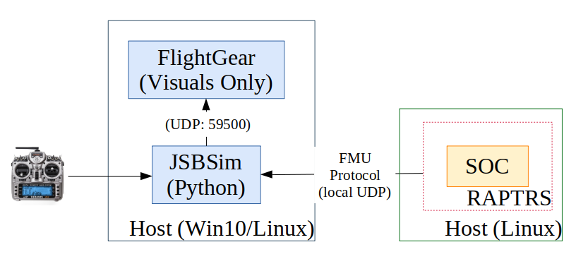
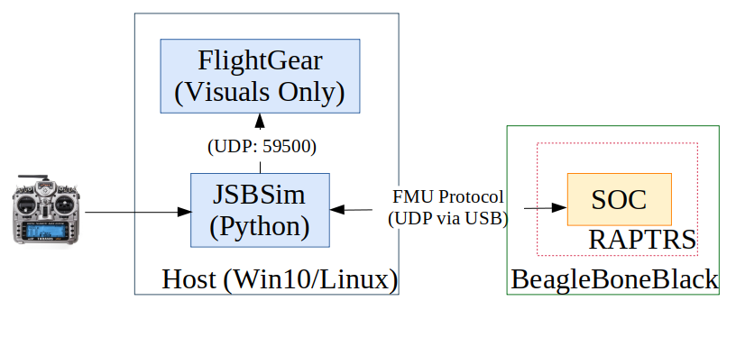

# OpenFlightSim
Open Flight Simulation (oFS)

www.uav.aem.umn.edu


oFS is a companion to OpenFlightAnalysis for data analysis and RAPTRS for flight software.

https://github.com/UASLab/OpenFlightAnalysis

https://github.com/bolderflight/RAPTRS


oFS is intended as a tool to generate and simulate flight vehicles. Currently, the tools use OpenVSP and/or AVL as sources for Aerodynamic data. The aerodynamic data is parsed and augmented with sub-system specification (propulsion, actuation, etc.) into an intermediate format known as oFDM (Open Flight Dynamics Model). The oFDM can be used to generate a complete simulation definition for JSBSim to make a flyable aircraft model. JSBSim models are augmented with addition I/O capability to allow for algorithm-in-the-loop, software-in-the-loop (SIL), and hardware-in-the-loop (HIL) testing. SIL and HIL testing relies on RAPTRS for flight control.

http://web.mit.edu/drela/Public/web/avl/

http://openvsp.org/

https://github.com/JSBSim-Team/jsbsim

http://home.flightgear.org/download/

# Modes of Operation
Common:
JSBSim executes with Python bindings.
JSBSim sends UDP packets (on 'localhost') to Flightgear for visuals, if desired, in all modes.

RAPTRS has several components relevant to modes of operation. The RAPTRS code-base contains code for the FMU and Node microcontrollers and the various sensor and effector drivers. The FMU and Node code is designed to only execute on the Teensy processors. RAPTRS also contains code for the SOC, in the nominal case a BeagleBoneBlack (BBB). This code can be compiled for either execution on the SOC or on a AMD64 Linux machine. Communication between the SOC and FMU is accomplished via UART messages defined in 'fmu_messages'; the particular messages and sequencing of communication is refered to as the FMU Protocol. 

RAPTRS requires a valid configuration file (.json) to run, that .json config must have a "JSBSim" definition block for RAPTRS-SOC to redirect communication to an appropriate port ("SimFmuPort" defines the tty-like port that RAPTRS will use to connect).

```
  "JSBSim": {
    "SimFmuPort": "ptySimSoc",
    "SimFmuBaud": 1500000
  }
  ```

## Algorithm in the Loop (AIL)
Uses control system defined in Python to provide control, JSBSim properties are read/write directly via Python bindings. This is useful in early stage development for defining algorithms when full end-to-end flight code is not required.


## Software in the Loop (SIL) 
RAPTRS-SOC is built for executing in native Linux (AMD64). The FMU Protocol is transported over TCP between the RAPTRS-SOC executable and Python (which is running the JSBSim simulation). Everything is run on a single Host machine (if the host is native Windows the RAPTRS-SOC code is executed in a WSL shell). SIL testing is good for checking the end-to-end validation of the flight code; since the RAPTRS-SOC code is not running in a flight-like system the particulars of system timming are not valid.

A joystick can be connected to allow for testing with pilot commands.



## Processor in the Loop (PIL) 
Advances on SIL; now RAPTRS-SOC code runs on a flight-configured SOC (BeagleBoneBlack) and interfaces with the Host machine via a USB connection. PIL testing allows for an inital check on realtime execution of RAPTRS. Data logging tests and Telemtry with hardware are also tested.

A joystick can be connected to allow for testing with pilot commands.



## Hardware in the Loop (HIL) or Aircraft in the Loop 
Advances on PIL; now the SOC is connected to a hardware FMU. Individual FMU<->SOC messages are controlled such that the FMU/SOC interface can be checked while still allowing simulated sensor data to be received by the SOC. Final execution testing is still required on the Aircraft without Simulation connections; HIL testing will alter some of the execution timing slightly.


# Install
## Linux (Debian 10.4): 
### Flightgear
```
sudo apt-get install flightgear
```

### JSBSim (Build from source)
```
sudo apt-get install cmake make g++ python3 cython3 python3-setuptools

mkdir Sim; cd Sim; mkdir JSBSim; cd JSBSim
sudo apt-get install git
git clone https://github.com/JSBSim-Team/jsbsim.git jsbsim-repo
mkdir build; cd build
cmake ../jsbsim-repo/ -DCYTHON_EXECUTABLE=/usr/bin/cython3 -DINSTALL_PYTHON_MODULE=ON
make JSBSim
make PythonJSBSim
make install
make test
```

### RAPTRS (Minimal for compiling SOC code for AMD64)

```
sudo apt-get install g++ libeigen3-dev socat

cd Goldy3
git clone https://github.com/UASLab/RAPTRS.git
cd RAPTRS
git checkout SimOverhaul

cd software;
make flight_amd64
make datalog_amd64
```

### OpenFlightSim
```
sudo apt-get install socat netcat python3-pygame python3-serial python3-numpy python3-pandas

mkdir Goldy3; cd Goldy3
git clone https://github.com/UASLab/OpenFlightSim.git
cd OpenFlightSim
git checkout SimOverhaul
cd Simulation
```

Tests 1:
Start FlightGear from a Terminal (Goldy3/OpenFlightSim/Simulation):

```./fgfs_JSBSim UltraStick25e```

then from another Terminal (Goldy3/OpenFlightSim/Simulation):

```JSBSim scripts/jsb_UltraStick25e_Cruise.xml```
(should run for 100 seconds)

Test 2:
Start FlightGear again, then from another Terminal (Goldy3/OpenFlightSim/Simulation):

```python3 python/JSBSim_Script_Demo.py```
(run for 10 seconds)

### Tests
Software in the Loop Test:
Using multiple terminals, all at: Goldy/OpenFligtSim/Simulation

```./start_CommSoc.sh``` (this should be able to just stay running)

```./fgfs_JSBSim.sh UltraStick25e``` (this should be able to just stay running)

```python3 python/JSBSim_SIL_Demo.py``` (runs through setup, then holds for the SOC to communicate)

```~/Goldy3/RAPTRS/software/bin/flight_amd64 ~/Goldy3/RAPTRS/config/thor.json```

(This should start a SIL, use a connected joystick to fly)

##  Windows 10 with Windows Linux Subsystem - (Debian 10.4)
FlightGear and JSBSim (Python bindings) will run on the Windows system directly. A Windows Linux Subsystem (WSL) will be used to compile and execute the RAPTRS-SOC code.

Install github desktop (https://desktop.github.com/)

Clone: https://github.com/UASLab/OpenFlightSim.git to {path to ...}/Goldy3/OpenFlightSim

Clone: https://github.com/UASLab/RAPTRS.git to {path to ...}/Goldy3/RAPTRS

Install WLS and Debian (https://docs.microsoft.com/en-us/windows/wsl/install-win10)


In a WLS-Debian Console, make a link to the Windows folder:

```ln -s /mnt/{path to ...}/Goldy3/ Goldy3```


OpenFlightSim uses the JSBSim Python bindings. First, get Python3 installed. Examples using conda as the Python Package Manager on Windows.

Install Miniconda: 
https://repo.anaconda.com/miniconda/Miniconda3-py38_4.8.3-Windows-x86_64.exe

Then open a "Anaconda Prompt" in Windows.

```
conda install numpy scipy matplotlib ipython jupyter pandas sympy nose h5py spyder pyserial
conda install -c conda-forge slycot control
pip install pygame
```

### Flightgear
Install FlightGear in Windows10. (https://www.flightgear.org/download/) Tested with version 2018.3.5.

Add FlightGear{version}/bin to the Windows Environment Path.

### JSBSim in Windows
Use JSBSim release: https://github.com/JSBSim-Team/jsbsim/releases

Open a "Anaconda Prompt" in Windows:

```
pip install jsbsim --no-index -f "https://github.com/JSBSim-Team/jsbsim/releases/download/Rolling-release-v2019/JSBSim-1.1.0.dev1-735-cp38-cp38-win_amd64.whl"
```

### RAPTRS in WSL-Debian (minimal for compiling SOC code for AMD64)
```
sudo apt-get install g++ libeigen3-dev socat

cd Goldy3/RAPTRS/software;
make flight_amd64
make datalog_amd64
```

## OpenFlightSim
Test 1:
Start FGFS in Windows with: fgfs_JSBSim.bat
then in a "Anaconda Prompt":

```JSBSim scripts/jsb_UltraStick25e_Cruise.xml```

(should run for 100 seconds)

Test 2:
with FGFS running...
then in a "Anaconda Prompt":

```python3 python/JSBSim_Script_Demo.py```

(should run for 10 seconds)

### Integrated Tests
Software in the Loop Test:
Start FGFS in Windows with: fgfs_JSBSim.bat (this should be able to just stay running)

In a WSL-Debian Console (at folder: Goldy3/OpenFlightSim/Simulation):

```./start_CommSoc.sh``` (this should be able to just stay running)

Anaconda Prompt (at folder: {path to ...}/Goldy3/OpenFlightSim/Simulation):

```python python\JSBSim_SIL_Demo.py```

In another WSL-Debian Console (at folder: Goldy3/OpenFlightSim/Simulation):

```~/Goldy3/RAPTRS/software/bin/flight_amd64 ~/Goldy3/RAPTRS/config/thor.json```

(This should start a SIL, use a connected joystick to fly)
